# 📋 SPESIFIKASI KEBUTUHAN PERANGKAT LUNAK (SKPL)
# UML Class Diagram - AcademySpace

**Nama Sistem:** AcademySpace - Campus Facility Reservation System  
**Versi:** 1.0  
**Tanggal:** 21 Desember 2025  

---

## 📊 1. UML Class Diagram

### 1.1 Domain Entity Classes (Complete dengan Semua Relasi)

### 1.1.1 Matriks Relasi Antar Entitas

| Dari | Ke | Tipe Relasi | Kardinalitas | Keterangan |
|------|-----|-------------|--------------|------------|
| **User** | UserRole | Composition | 1:1 | Setiap user memiliki 1 role |
| **User** | Reservation | Aggregation | 1:N | User membuat banyak reservasi |
| **User** | Notification | Aggregation | 1:N | User menerima banyak notifikasi |
| **User** | Rating | Aggregation | 1:N | User menulis banyak rating |
| **User** | ApprovalLog | Aggregation | 1:N | Admin melakukan banyak approval |
| **User** | ReservationAudit | Aggregation | 1:N | User mencatat banyak perubahan |
| **User** | SystemToken | Dependency | N:1 | User validasi dengan token |
| **Building** | Facility | Aggregation | 1:N | Gedung memiliki banyak fasilitas |
| **FacilityType** | Facility | Aggregation | 1:N | Tipe mengkategorikan fasilitas |
| **Facility** | ReservationItem | Aggregation | 1:N | Fasilitas dipesan di banyak item |
| **Facility** | Rating | Aggregation | 1:N | Fasilitas memiliki banyak rating |
| **Reservation** | User | Composition | N:1 | Reservasi dimiliki 1 user |
| **Reservation** | ReservationStatus | Composition | N:1 | Reservasi memiliki 1 status |
| **Reservation** | ReservationItem | Composition | 1:N | Reservasi berisi banyak item |
| **Reservation** | ApprovalLog | Aggregation | 1:N | Reservasi memiliki log approval |
| **Reservation** | ReservationAudit | Aggregation | 1:N | Reservasi memiliki audit trail |
| **Reservation** | Notification | Aggregation | 1:N | Reservasi memicu notifikasi |
| **Reservation** | Rating | Aggregation | 1:0..1 | Reservasi bisa di-rating sekali |
| **ReservationItem** | Facility | Composition | N:1 | Item untuk 1 fasilitas |
| **ApprovalLog** | ApprovalAction | Composition | N:1 | Log menggunakan 1 action enum |
| **ReservationAudit** | AuditChangeType | Composition | N:1 | Audit menggunakan 1 change type |
| **Notification** | ReservationStatus | Aggregation | N:0..1 | Notifikasi bisa referensi status |
| **Rating** | Facility | Composition | N:1 | Rating untuk 1 fasilitas |
| **Rating** | Reservation | Composition | N:1 | Rating dari 1 reservasi |

---

### 1.2 Service Layer Classes

---

### 1.3 Repository Layer Classes

---

### 1.4 Controller Layer Classes

```mermaid
classDiagram
    direction TB

    %%============================================================
    %% AUTH CONTROLLER
    %%============================================================

    class AuthController {
        <<Controller>>
        -userService: UserService
        +register(req: Request, res: Response) void
        +login(req: Request, res: Response) void
        +getMe(req: Request, res: Response) void
        +resetPassword(req: Request, res: Response) void
    }

    %%============================================================
    %% USER CONTROLLER
    %%============================================================

    class UserController {
        <<Controller>>
        -userService: UserService
        +getAllUsers(req: Request, res: Response) void
        +getUserById(req: Request, res: Response) void
        +createUser(req: Request, res: Response) void
        +updateUser(req: Request, res: Response) void
        +deleteUser(req: Request, res: Response) void
        +promoteToAdmin(req: Request, res: Response) void
        +demoteToUser(req: Request, res: Response) void
        +suspendUser(req: Request, res: Response) void
        +unsuspendUser(req: Request, res: Response) void
        +getMyProfile(req: Request, res: Response) void
        +updateMyProfile(req: Request, res: Response) void
        +updateProfileAvatar(req: Request, res: Response) void
        +deleteProfileAvatar(req: Request, res: Response) void
    }

    %%============================================================
    %% FACILITY CONTROLLER
    %%============================================================

    class FacilityController {
        <<Controller>>
        -facilityService: FacilityService
        +getAllFacilities(req: Request, res: Response) void
        +getFacilityById(req: Request, res: Response) void
        +createFacility(req: Request, res: Response) void
        +updateFacility(req: Request, res: Response) void
        +deleteFacility(req: Request, res: Response) void
        +getFacilityReservations(req: Request, res: Response) void
        +setMaintenance(req: Request, res: Response) void
        +clearMaintenance(req: Request, res: Response) void
    }

    %%============================================================
    %% BUILDING CONTROLLER
    %%============================================================

    class BuildingController {
        <<Controller>>
        +getAllBuildings(req: Request, res: Response) void
    }

    %%============================================================
    %% FACILITY TYPE CONTROLLER
    %%============================================================

    class FacilityTypeController {
        <<Controller>>
        +getAllFacilityTypes(req: Request, res: Response) void
    }

    %%============================================================
    %% RESERVATION CONTROLLER
    %%============================================================

    class ReservationController {
        <<Controller>>
        -reservationService: ReservationService
        +createReservation(req: Request, res: Response) void
        +getUserReservations(req: Request, res: Response) void
        +getAllReservations(req: Request, res: Response) void
        +getReservationById(req: Request, res: Response) void
        +updateReservation(req: Request, res: Response) void
        +updateReservationStatus(req: Request, res: Response) void
        +cancelReservation(req: Request, res: Response) void
        +getReservationStats(req: Request, res: Response) void
        +getFacilityUtilization(req: Request, res: Response) void
        +getUserActivity(req: Request, res: Response) void
    }

    %%============================================================
    %% NOTIFICATION CONTROLLER
    %%============================================================

    class NotificationController {
        <<Controller>>
        -notificationService: NotificationService
        +getUserNotifications(req: Request, res: Response) void
        +markNotificationAsRead(req: Request, res: Response) void
        +markAllNotificationsAsRead(req: Request, res: Response) void
        +deleteNotification(req: Request, res: Response) void
    }

    %%============================================================
    %% RATING CONTROLLER
    %%============================================================

    class RatingController {
        <<Controller>>
        -ratingService: RatingService
        +createRating(req: Request, res: Response) void
        +getRatingsByFacility(req: Request, res: Response) void
        +getAverageRatingForFacility(req: Request, res: Response) void
        +getUserRatingForReservation(req: Request, res: Response) void
    }

    %%============================================================
    %% DASHBOARD CONTROLLER
    %%============================================================

    class DashboardController {
        <<Controller>>
        +getDashboardStats(req: Request, res: Response) void
        +getSystemTokens(req: Request, res: Response) void
    }

    %%============================================================
    %% UPLOAD CONTROLLER
    %%============================================================

    class UploadController {
        <<Controller>>
        +uploadFile(req: Request, res: Response) void
    }
```

---

## 📋 2. Tabel Entitas

### 2.1 Tabel User

| No | Atribut | Tipe Data | Keterangan |
|----|---------|-----------|------------|
| 1 | user_id | INT | Primary Key, Auto Increment |
| 2 | username | VARCHAR(255) | Username unik, NOT NULL |
| 3 | password_hash | VARCHAR(255) | Password terenkripsi, NOT NULL |
| 4 | full_name | VARCHAR(255) | Nama lengkap, NOT NULL |
| 5 | role | ENUM | 'admin' atau 'user' |
| 6 | profile_picture_url | VARCHAR(255) | URL foto profil |
| 7 | verification_token | VARCHAR(255) | Token verifikasi email |
| 8 | recovery_token | VARCHAR(255) | Token reset password |
| 9 | is_suspended | BOOLEAN | Status akun suspended |
| 10 | created_at | TIMESTAMP | Waktu pembuatan akun |
| 11 | last_login_at | TIMESTAMP | Waktu login terakhir |

**Methods:**
| No | Method | Return Type | Deskripsi |
|----|--------|-------------|-----------|
| 1 | register() | User | Mendaftarkan user baru |
| 2 | login() | Token | Login dan mendapatkan token |
| 3 | logout() | void | Logout dari sistem |
| 4 | updateProfile() | User | Mengupdate profil user |
| 5 | changePassword() | boolean | Mengubah password |
| 6 | uploadAvatar() | string | Upload foto profil |
| 7 | deleteAvatar() | boolean | Hapus foto profil |

---

### 2.2 Tabel Building

| No | Atribut | Tipe Data | Keterangan |
|----|---------|-----------|------------|
| 1 | building_id | INT | Primary Key, Auto Increment |
| 2 | name | VARCHAR(255) | Nama gedung, NOT NULL |
| 3 | code | VARCHAR(50) | Kode gedung |
| 4 | location_description | TEXT | Deskripsi lokasi gedung |
| 5 | image_url | VARCHAR(255) | URL gambar gedung |
| 6 | created_at | TIMESTAMP | Waktu pembuatan |
| 7 | updated_at | TIMESTAMP | Waktu update terakhir |

**Methods:**
| No | Method | Return Type | Deskripsi |
|----|--------|-------------|-----------|
| 1 | getAll() | Building[] | Mendapatkan semua gedung |
| 2 | getById() | Building | Mendapatkan gedung by ID |
| 3 | create() | Building | Membuat gedung baru |
| 4 | update() | Building | Mengupdate data gedung |
| 5 | delete() | boolean | Menghapus gedung |

---

### 2.3 Tabel FacilityType

| No | Atribut | Tipe Data | Keterangan |
|----|---------|-----------|------------|
| 1 | type_id | INT | Primary Key, Auto Increment |
| 2 | name | VARCHAR(255) | Nama tipe fasilitas, NOT NULL |
| 3 | description | TEXT | Deskripsi tipe fasilitas |

**Methods:**
| No | Method | Return Type | Deskripsi |
|----|--------|-------------|-----------|
| 1 | getAll() | FacilityType[] | Mendapatkan semua tipe |
| 2 | getById() | FacilityType | Mendapatkan tipe by ID |
| 3 | create() | FacilityType | Membuat tipe baru |
| 4 | update() | FacilityType | Mengupdate tipe |
| 5 | delete() | boolean | Menghapus tipe |

---

### 2.4 Tabel Facility

| No | Atribut | Tipe Data | Keterangan |
|----|---------|-----------|------------|
| 1 | facility_id | INT | Primary Key, Auto Increment |
| 2 | type_id | INT | Foreign Key ke FacilityType |
| 3 | building_id | INT | Foreign Key ke Building |
| 4 | name | VARCHAR(255) | Nama fasilitas, NOT NULL |
| 5 | room_number | VARCHAR(50) | Nomor ruangan |
| 6 | capacity | INT | Kapasitas ruangan |
| 7 | floor | INT | Lantai lokasi |
| 8 | description | TEXT | Deskripsi fasilitas |
| 9 | layout_description | TEXT | Deskripsi layout |
| 10 | photo_url | VARCHAR(255) | URL foto fasilitas |
| 11 | is_active | BOOLEAN | Status aktif |
| 12 | maintenance_until | TIMESTAMP | Maintenance sampai tanggal |
| 13 | maintenance_reason | TEXT | Alasan maintenance |
| 14 | created_at | TIMESTAMP | Waktu pembuatan |
| 15 | updated_at | TIMESTAMP | Waktu update terakhir |

**Methods:**
| No | Method | Return Type | Deskripsi |
|----|--------|-------------|-----------|
| 1 | getAll() | Facility[] | Mendapatkan semua fasilitas |
| 2 | getById() | Facility | Mendapatkan fasilitas by ID |
| 3 | create() | Facility | Membuat fasilitas baru |
| 4 | update() | Facility | Mengupdate fasilitas |
| 5 | delete() | boolean | Menghapus fasilitas |
| 6 | setMaintenance() | Facility | Set status maintenance |
| 7 | clearMaintenance() | Facility | Clear status maintenance |
| 8 | checkAvailability() | boolean | Cek ketersediaan |
| 9 | getReservations() | Reservation[] | Mendapatkan reservasi |

---

### 2.5 Tabel ReservationStatus

| No | Atribut | Tipe Data | Keterangan |
|----|---------|-----------|------------|
| 1 | status_id | INT | Primary Key, Auto Increment |
| 2 | name | VARCHAR(50) | Nama status, NOT NULL |
| 3 | description | TEXT | Deskripsi status |

**Status Values:**
| ID | Name | Deskripsi |
|----|------|-----------|
| 1 | PENDING | Menunggu persetujuan admin |
| 2 | APPROVED | Reservasi disetujui |
| 3 | REJECTED | Reservasi ditolak |
| 4 | CANCELED | Reservasi dibatalkan |

---

### 2.6 Tabel Reservation

| No | Atribut | Tipe Data | Keterangan |
|----|---------|-----------|------------|
| 1 | reservation_id | INT | Primary Key, Auto Increment |
| 2 | requester_id | INT | Foreign Key ke User, NOT NULL |
| 3 | status_id | INT | Foreign Key ke ReservationStatus, NOT NULL |
| 4 | purpose | TEXT | Tujuan reservasi, NOT NULL |
| 5 | attendees | INT | Jumlah peserta |
| 6 | proposal_url | VARCHAR(255) | URL file proposal |
| 7 | is_canceled | BOOLEAN | Flag pembatalan |
| 8 | created_at | TIMESTAMP | Waktu pembuatan |
| 9 | updated_at | TIMESTAMP | Waktu update terakhir |

**Methods:**
| No | Method | Return Type | Deskripsi |
|----|--------|-------------|-----------|
| 1 | create() | Reservation | Membuat reservasi baru |
| 2 | update() | Reservation | Mengupdate reservasi |
| 3 | cancel() | boolean | Membatalkan reservasi |
| 4 | approve() | Reservation | Menyetujui reservasi |
| 5 | reject() | Reservation | Menolak reservasi |
| 6 | getById() | Reservation | Mendapatkan reservasi by ID |
| 7 | getByUser() | Reservation[] | Mendapatkan reservasi by user |
| 8 | getAll() | Reservation[] | Mendapatkan semua reservasi |

---

### 2.7 Tabel ReservationItem

| No | Atribut | Tipe Data | Keterangan |
|----|---------|-----------|------------|
| 1 | item_id | INT | Primary Key, Auto Increment |
| 2 | reservation_id | INT | Foreign Key ke Reservation, NOT NULL |
| 3 | facility_id | INT | Foreign Key ke Facility, NOT NULL |
| 4 | start_datetime | TIMESTAMP | Waktu mulai, NOT NULL |
| 5 | end_datetime | TIMESTAMP | Waktu selesai, NOT NULL |
| 6 | created_at | TIMESTAMP | Waktu pembuatan |

**Constraints:**
- `CHECK (end_datetime > start_datetime)`
- `CHECK (facility_id IS NOT NULL)`

**Methods:**
| No | Method | Return Type | Deskripsi |
|----|--------|-------------|-----------|
| 1 | create() | ReservationItem | Membuat item baru |
| 2 | update() | ReservationItem | Mengupdate item |
| 3 | delete() | boolean | Menghapus item |
| 4 | checkConflict() | boolean | Cek konflik jadwal |

---

### 2.8 Tabel ApprovalLog

| No | Atribut | Tipe Data | Keterangan |
|----|---------|-----------|------------|
| 1 | approval_id | INT | Primary Key, Auto Increment |
| 2 | reservation_id | INT | Foreign Key ke Reservation, NOT NULL |
| 3 | acted_by | INT | Foreign Key ke User (Admin), NOT NULL |
| 4 | action | ENUM | PENDING/APPROVED/REJECTED/CANCELED |
| 5 | comment | TEXT | Komentar approval |
| 6 | acted_at | TIMESTAMP | Waktu aksi |

**Methods:**
| No | Method | Return Type | Deskripsi |
|----|--------|-------------|-----------|
| 1 | create() | ApprovalLog | Membuat log baru |
| 2 | getByReservation() | ApprovalLog[] | Mendapatkan log by reservasi |

---

### 2.9 Tabel ReservationAudit

| No | Atribut | Tipe Data | Keterangan |
|----|---------|-----------|------------|
| 1 | audit_id | INT | Primary Key, Auto Increment |
| 2 | reservation_id | INT | Foreign Key ke Reservation, NOT NULL |
| 3 | changed_by | INT | Foreign Key ke User |
| 4 | change_type | ENUM | CREATE/UPDATE/DELETE/CANCEL |
| 5 | change_data | JSONB | Data perubahan |
| 6 | changed_at | TIMESTAMP | Waktu perubahan |

**Methods:**
| No | Method | Return Type | Deskripsi |
|----|--------|-------------|-----------|
| 1 | create() | ReservationAudit | Membuat audit log |
| 2 | getByReservation() | ReservationAudit[] | Mendapatkan audit by reservasi |

---

### 2.10 Tabel Notification

| No | Atribut | Tipe Data | Keterangan |
|----|---------|-----------|------------|
| 1 | notification_id | INT | Primary Key, Auto Increment |
| 2 | user_id | INT | Foreign Key ke User, NOT NULL |
| 3 | reservation_id | INT | Foreign Key ke Reservation |
| 4 | title | VARCHAR(255) | Judul notifikasi |
| 5 | message | TEXT | Isi pesan notifikasi |
| 6 | is_read | BOOLEAN | Status sudah dibaca |
| 7 | status_id | INT | Foreign Key ke ReservationStatus |
| 8 | created_at | TIMESTAMP | Waktu pembuatan |

**Methods:**
| No | Method | Return Type | Deskripsi |
|----|--------|-------------|-----------|
| 1 | create() | Notification | Membuat notifikasi baru |
| 2 | getByUser() | Notification[] | Mendapatkan notifikasi user |
| 3 | markAsRead() | boolean | Tandai sudah dibaca |
| 4 | markAllAsRead() | boolean | Tandai semua sudah dibaca |
| 5 | delete() | boolean | Hapus notifikasi |

---

### 2.11 Tabel Rating

| No | Atribut | Tipe Data | Keterangan |
|----|---------|-----------|------------|
| 1 | rating_id | INT | Primary Key, Auto Increment |
| 2 | user_id | INT | Foreign Key ke User, NOT NULL |
| 3 | facility_id | INT | Foreign Key ke Facility, NOT NULL |
| 4 | reservation_id | INT | Foreign Key ke Reservation, NOT NULL |
| 5 | rating | INT | Nilai rating 1-5, NOT NULL |
| 6 | review | TEXT | Ulasan text |
| 7 | created_at | TIMESTAMP | Waktu pembuatan |

**Constraints:**
- `CHECK (rating >= 1 AND rating <= 5)`

**Methods:**
| No | Method | Return Type | Deskripsi |
|----|--------|-------------|-----------|
| 1 | create() | Rating | Membuat rating baru |
| 2 | getByFacility() | Rating[] | Mendapatkan rating fasilitas |
| 3 | getAverageByFacility() | number | Mendapatkan rata-rata rating |
| 4 | getByUserReservation() | Rating | Mendapatkan rating user |

---

### 2.12 Tabel SystemToken

| No | Atribut | Tipe Data | Keterangan |
|----|---------|-----------|------------|
| 1 | key | VARCHAR(255) | Primary Key |
| 2 | value | VARCHAR(255) | Nilai token, NOT NULL |
| 3 | description | TEXT | Deskripsi token |

**Token Types:**
| Key | Deskripsi |
|-----|-----------|
| ADMIN_REG_TOKEN | Token untuk registrasi admin |
| RESET_PASS_TOKEN | Token untuk reset password |

**Methods:**
| No | Method | Return Type | Deskripsi |
|----|--------|-------------|-----------|
| 1 | get() | string | Mendapatkan nilai token |
| 2 | set() | boolean | Set nilai token |
| 3 | validate() | boolean | Validasi token |

---

## 📐 3. Relasi Antar Entitas

---

## 📊 4. Ringkasan Entitas

| No | Entitas | Jumlah Atribut | Jumlah Method | Deskripsi |
|----|---------|----------------|---------------|-----------|
| 1 | User | 11 | 7 | Pengguna sistem |
| 2 | Building | 7 | 5 | Gedung kampus |
| 3 | FacilityType | 3 | 5 | Tipe fasilitas |
| 4 | Facility | 15 | 9 | Fasilitas/ruangan |
| 5 | ReservationStatus | 3 | 3 | Status reservasi |
| 6 | Reservation | 9 | 8 | Data reservasi |
| 7 | ReservationItem | 6 | 4 | Item detail reservasi |
| 8 | ApprovalLog | 6 | 2 | Log persetujuan |
| 9 | ReservationAudit | 6 | 2 | Audit trail |
| 10 | Notification | 8 | 5 | Notifikasi pengguna |
| 11 | Rating | 7 | 4 | Rating & review |
| 12 | SystemToken | 3 | 3 | Token sistem |
| **Total** | **12 Entitas** | **94 Atribut** | **57 Methods** | |

---

## 📁 5. Lokasi File

| File | Lokasi | Deskripsi |
|------|--------|-----------|
| SKPL Class Diagram | `docs/SKPL_UML_Class_Diagram.md` | Dokumen ini |
| PlantUML Version | `docs/UML_Class_Diagram.puml` | Versi PlantUML |
| Mermaid Full | `docs/UML_Class_Diagram.mermaid.md` | Versi Mermaid lengkap |
| Documentation | `docs/UML_Class_Diagram.md` | Dokumentasi umum |

---

**Dibuat oleh:** Tim Pengembang AcademySpace  
**Tanggal:** 21 Desember 2025  
**Versi Dokumen:** 1.0
