# AcademySpace - UML Class Diagram (Mermaid)

**Last Updated:** December 21, 2025

## Complete Class Diagram

```mermaid
classDiagram
    direction TB

    %% ============================================
    %% ENUMERATIONS
    %% ============================================
    class UserRole {
        <<enumeration>>
        admin
        user
    }

    class ApprovalAction {
        <<enumeration>>
        PENDING
        APPROVED
        REJECTED
        CANCELED
    }

    class AuditChange {
        <<enumeration>>
        CREATE
        UPDATE
        DELETE
        CANCEL
    }

    %% ============================================
    %% DOMAIN ENTITIES
    %% ============================================
    class SystemToken {
        <<Entity>>
        +String key
        +String value
        +String description
    }

    class User {
        <<Entity>>
        +Int user_id
        +String username
        +String password_hash
        +String full_name
        +UserRole role
        +String profile_picture_url
        +String verification_token
        +String recovery_token
        +Boolean is_suspended
        +DateTime created_at
        +DateTime last_login_at
    }

    class FacilityType {
        <<Entity>>
        +Int type_id
        +String name
        +String description
    }

    class Building {
        <<Entity>>
        +Int building_id
        +String name
        +String code
        +String location_description
        +String image_url
        +DateTime created_at
        +DateTime updated_at
    }

    class Facility {
        <<Entity>>
        +Int facility_id
        +Int type_id
        +Int building_id
        +String name
        +String room_number
        +Int capacity
        +Int floor
        +String description
        +String layout_description
        +String photo_url
        +Boolean is_active
        +DateTime maintenance_until
        +String maintenance_reason
        +DateTime created_at
        +DateTime updated_at
    }

    class ReservationStatus {
        <<Entity>>
        +Int status_id
        +String name
        +String description
    }

    class Reservation {
        <<Entity>>
        +Int reservation_id
        +Int requester_id
        +Int status_id
        +String purpose
        +Int attendees
        +String proposal_url
        +DateTime created_at
        +DateTime updated_at
        +Boolean is_canceled
    }

    class ReservationItem {
        <<Entity>>
        +Int item_id
        +Int reservation_id
        +Int facility_id
        +DateTime start_datetime
        +DateTime end_datetime
        +DateTime created_at
    }

    class ApprovalLog {
        <<Entity>>
        +Int approval_id
        +Int reservation_id
        +Int acted_by
        +ApprovalAction action
        +String comment
        +DateTime acted_at
    }

    class ReservationAudit {
        <<Entity>>
        +Int audit_id
        +Int reservation_id
        +Int changed_by
        +AuditChange change_type
        +JSON change_data
        +DateTime changed_at
    }

    class Notification {
        <<Entity>>
        +Int notification_id
        +Int user_id
        +Int reservation_id
        +String title
        +String message
        +Boolean is_read
        +Int status_id
        +DateTime created_at
    }

    class Rating {
        <<Entity>>
        +Int rating_id
        +Int user_id
        +Int facility_id
        +Int reservation_id
        +Int rating
        +String review
        +DateTime created_at
    }

    %% ============================================
    %% REPOSITORIES
    %% ============================================
    class BaseRepository~T~ {
        <<Repository>>
        #String tableName
        #String primaryKey
        +findAll() Promise~T[]~
        +findById(id) Promise~T~
        +create(data) Promise~T~
        +update(id, data) Promise~T~
        +delete(id) Promise~Boolean~
    }

    class UserRepository {
        <<Repository>>
        +findAll() Promise~User[]~
        +findById(id) Promise~User~
        +findByUsername(username) Promise~User~
        +create(data) Promise~User~
        +update(id, data) Promise~User~
        +delete(id) Promise~Boolean~
    }

    class FacilityRepository {
        <<Repository>>
        +findAll(filters) Promise~Facility[]~
        +findById(id) Promise~Facility~
        +create(data) Promise~Facility~
        +update(id, data) Promise~Facility~
        +delete(id) Promise~Boolean~
        +findByBuilding(buildingId) Promise~Facility[]~
        +findByType(typeId) Promise~Facility[]~
    }

    class BuildingRepository {
        <<Repository>>
        +findAll() Promise~Building[]~
        +findById(id) Promise~Building~
    }

    class FacilityTypeRepository {
        <<Repository>>
        +findAll() Promise~FacilityType[]~
        +findById(id) Promise~FacilityType~
    }

    class ReservationRepository {
        <<Repository>>
        +findAll() Promise~Reservation[]~
        +findById(id) Promise~Reservation~
        +findByUserId(userId) Promise~Reservation[]~
        +create(data) Promise~Reservation~
        +update(id, data) Promise~Reservation~
        +updateStatus(id, statusId) Promise~Reservation~
        +createItem(data) Promise~ReservationItem~
        +updateItem(id, data) Promise~ReservationItem~
        +deleteItems(reservationId) Promise~Boolean~
        +checkConflict(facilityId, start, end) Promise~Boolean~
    }

    class NotificationRepository {
        <<Repository>>
        +findByUserId(userId) Promise~Notification[]~
        +create(data) Promise~Notification~
        +markAsRead(userId, notificationId) Promise~Boolean~
        +markAllAsRead(userId) Promise~Boolean~
        +delete(userId, notificationId) Promise~Boolean~
    }

    class RatingRepository {
        <<Repository>>
        +findByFacilityId(facilityId) Promise~Rating[]~
        +getAverageByFacilityId(facilityId) Promise~Number~
        +findByUserAndReservation(userId, reservationId) Promise~Rating~
        +create(data) Promise~Rating~
    }

    %% ============================================
    %% SERVICES
    %% ============================================
    class BaseService~T~ {
        <<Service>>
        #BaseRepository~T~ repository
        +findAll() Promise~T[]~
        +findById(id) Promise~T~
        +create(data) Promise~T~
        +update(id, data) Promise~T~
        +delete(id) Promise~Boolean~
    }

    class UserService {
        <<Service>>
        -UserRepository userRepository
        +findAll() Promise~User[]~
        +findById(id) Promise~User~
        +findByUsername(username) Promise~User~
        +create(data) Promise~User~
        +update(id, data) Promise~User~
        +delete(id) Promise~Boolean~
        +validateAdminToken(token) Promise~Boolean~
        +validateResetToken(token) Promise~Boolean~
    }

    class FacilityService {
        <<Service>>
        -FacilityRepository facilityRepository
        +findAll(filters) Promise~Facility[]~
        +findById(id) Promise~Facility~
        +create(data) Promise~Facility~
        +update(id, data) Promise~Facility~
        +delete(id) Promise~Boolean~
        +checkAvailability(facilityId, date, startTime, endTime) Promise~Boolean~
    }

    class ReservationService {
        <<Service>>
        -ReservationRepository reservationRepository
        -FacilityRepository facilityRepository
        -UserRepository userRepository
        -NotificationRepository notificationRepository
        +create(data) Promise~Reservation~
        +getUserReservations(userId) Promise~Reservation[]~
        +getAllReservations() Promise~Reservation[]~
        +getById(id, requesterId) Promise~Reservation~
        +update(id, userId, data) Promise~Reservation~
        +updateStatus(id, status) Promise~Reservation~
        +cancel(id, userId) Promise~Boolean~
    }

    class NotificationService {
        <<Service>>
        -NotificationRepository notificationRepository
        +getUserNotifications(userId) Promise~Notification[]~
        +create(data) Promise~Notification~
        +markAsRead(userId, notificationId) Promise~Boolean~
        +markAllAsRead(userId) Promise~Boolean~
        +deleteNotification(userId, notificationId) Promise~Boolean~
    }

    class RatingService {
        <<Service>>
        -RatingRepository ratingRepository
        +createRating(data) Promise~Rating~
        +getRatingsByFacility(facilityId) Promise~Rating[]~
        +getAverageRatingForFacility(facilityId) Promise~Number~
        +getUserRatingForReservation(userId, reservationId) Promise~Rating~
    }

    %% ============================================
    %% CONTROLLERS
    %% ============================================
    class AuthController {
        <<Controller>>
        +register(req, res) void
        +login(req, res) void
        +getMe(req, res) void
        +resetPassword(req, res) void
    }

    class UserController {
        <<Controller>>
        +getAllUsers(req, res) void
        +getUserById(req, res) void
        +createUser(req, res) void
        +updateUser(req, res) void
        +deleteUser(req, res) void
        +promoteToAdmin(req, res) void
        +demoteToUser(req, res) void
        +suspendUser(req, res) void
        +unsuspendUser(req, res) void
        +getMyProfile(req, res) void
        +updateMyProfile(req, res) void
        +updateProfileAvatar(req, res) void
        +deleteProfileAvatar(req, res) void
    }

    class FacilityController {
        <<Controller>>
        +getAllFacilities(req, res) void
        +getFacilityById(req, res) void
        +createFacility(req, res) void
        +updateFacility(req, res) void
        +deleteFacility(req, res) void
        +getFacilityReservations(req, res) void
        +setMaintenance(req, res) void
        +clearMaintenance(req, res) void
    }

    class BuildingController {
        <<Controller>>
        +getAllBuildings(req, res) void
    }

    class FacilityTypeController {
        <<Controller>>
        +getAllFacilityTypes(req, res) void
    }

    class ReservationController {
        <<Controller>>
        +createReservation(req, res) void
        +getUserReservations(req, res) void
        +getAllReservations(req, res) void
        +getReservationById(req, res) void
        +updateReservation(req, res) void
        +updateReservationStatus(req, res) void
        +cancelReservation(req, res) void
        +getReservationStats(req, res) void
        +getFacilityUtilization(req, res) void
        +getUserActivity(req, res) void
    }

    class NotificationController {
        <<Controller>>
        +getUserNotifications(req, res) void
        +markNotificationAsRead(req, res) void
        +markAllNotificationsAsRead(req, res) void
        +deleteNotification(req, res) void
    }

    class RatingController {
        <<Controller>>
        +createRating(req, res) void
        +getRatingsByFacility(req, res) void
        +getAverageRatingForFacility(req, res) void
        +getUserRatingForReservation(req, res) void
    }

    class DashboardController {
        <<Controller>>
        +getDashboardStats(req, res) void
        +getSystemTokens(req, res) void
    }

    class UploadController {
        <<Controller>>
        +uploadFile(req, res) void
    }

    %% ============================================
    %% ENTITY RELATIONSHIPS
    %% ============================================
    User --> UserRole : has role
    User "1" --> "0..*" Reservation : creates
    User "1" --> "0..*" Notification : receives
    User "1" --> "0..*" Rating : writes
    User "1" --> "0..*" ApprovalLog : acts
    User "1" --> "0..*" ReservationAudit : changes

    Facility "0..*" --> "1" FacilityType : has type
    Facility "0..*" --> "0..1" Building : located in
    Facility "1" --> "0..*" ReservationItem : reserved in
    Facility "1" --> "0..*" Rating : has ratings

    Reservation "0..*" --> "1" User : requested by
    Reservation "0..*" --> "1" ReservationStatus : has status
    Reservation "1" --> "1..*" ReservationItem : contains
    Reservation "1" --> "0..*" ApprovalLog : has logs
    Reservation "1" --> "0..*" ReservationAudit : has audit
    Reservation "1" --> "0..*" Notification : generates
    Reservation "1" --> "0..*" Rating : can be rated

    Notification "0..*" --> "0..1" ReservationStatus : references

    ApprovalLog --> ApprovalAction : uses
    ReservationAudit --> AuditChange : uses

    %% ============================================
    %% LAYER RELATIONSHIPS
    %% ============================================
    BaseRepository <|-- UserRepository
    BaseRepository <|-- FacilityRepository
    BaseRepository <|-- ReservationRepository

    BaseService <|-- UserService
    BaseService <|-- FacilityService

    UserService ..> UserRepository : uses
    FacilityService ..> FacilityRepository : uses
    ReservationService ..> ReservationRepository : uses
    ReservationService ..> FacilityRepository : uses
    ReservationService ..> UserRepository : uses
    ReservationService ..> NotificationRepository : uses
    NotificationService ..> NotificationRepository : uses
    RatingService ..> RatingRepository : uses

    AuthController ..> UserService : uses
    UserController ..> UserService : uses
    FacilityController ..> FacilityService : uses
    ReservationController ..> ReservationService : uses
    NotificationController ..> NotificationService : uses
    RatingController ..> RatingService : uses
```

---

## Entity Relationships Only (Simplified)

---

## Architecture Layers

```mermaid
flowchart TB
    subgraph Presentation["🎨 Presentation Layer"]
        AuthC[AuthController]
        UserC[UserController]
        FacilityC[FacilityController]
        ReservationC[ReservationController]
        NotificationC[NotificationController]
        RatingC[RatingController]
        DashboardC[DashboardController]
    end

    subgraph Business["⚙️ Business Logic Layer"]
        UserS[UserService]
        FacilityS[FacilityService]
        ReservationS[ReservationService]
        NotificationS[NotificationService]
        RatingS[RatingService]
    end

    subgraph DataAccess["💾 Data Access Layer"]
        UserR[UserRepository]
        FacilityR[FacilityRepository]
        BuildingR[BuildingRepository]
        ReservationR[ReservationRepository]
        NotificationR[NotificationRepository]
        RatingR[RatingRepository]
    end

    subgraph Database["🗄️ Database Layer"]
        PG[(PostgreSQL)]
        Redis[(Redis Cache)]
    end

    AuthC --> UserS
    UserC --> UserS
    FacilityC --> FacilityS
    ReservationC --> ReservationS
    NotificationC --> NotificationS
    RatingC --> RatingS

    UserS --> UserR
    FacilityS --> FacilityR
    ReservationS --> ReservationR
    ReservationS --> FacilityR
    ReservationS --> NotificationR
    NotificationS --> NotificationR
    RatingS --> RatingR

    UserR --> PG
    FacilityR --> PG
    FacilityR --> Redis
    BuildingR --> PG
    ReservationR --> PG
    NotificationR --> PG
    RatingR --> PG
```

---

## Reservation Flow Sequence

---

## Notes

- **Mermaid** dapat langsung dirender di GitHub, GitLab, Notion, dan banyak platform lainnya
- Untuk melihat di VS Code, install extension **"Markdown Preview Mermaid Support"**
- Diagram ini sudah sesuai dengan struktur project terbaru (December 2025)
