# Academy Space - Class Diagram (MVC Pattern)

Class diagram dengan pengelompokan MVC yang sudah disesuaikan dengan implementasi.

## Mermaid Code (Copy-Paste Ready)

```mermaid
classDiagram
direction TB

    %% ============================================
    %% MODEL LAYER - Entities
    %% ============================================
    
    class User {
        +int user_id
        +string username
        +string password_hash
        +string full_name
        +string role
        +string profile_picture_url
        +string verification_token
        +string recovery_token
        +boolean is_suspended
        +datetime created_at
        +datetime last_login_at
    }

    class Building {
        +int building_id
        +string name
        +string code
        +string location_description
        +string image_url
        +datetime created_at
        +datetime updated_at
    }

    class FacilityType {
        +int type_id
        +string name
        +string description
    }

    class Facility {
        +int facility_id
        +int type_id
        +int building_id
        +string name
        +string room_number
        +int capacity
        +int floor
        +string description
        +string layout_description
        +string photo_url
        +boolean is_active
        +datetime maintenance_until
        +string maintenance_reason
        +datetime created_at
        +datetime updated_at
    }

    class ReservationStatus {
        +int status_id
        +string name
        +string description
    }

    class Reservation {
        +int reservation_id
        +int requester_id
        +int status_id
        +string purpose
        +int attendees
        +string proposal_url
        +boolean is_canceled
        +datetime created_at
        +datetime updated_at
    }

    class ReservationItem {
        +int item_id
        +int reservation_id
        +int facility_id
        +datetime start_datetime
        +datetime end_datetime
        +datetime created_at
    }

    class ApprovalLog {
        +int approval_id
        +int reservation_id
        +int acted_by
        +string action
        +string comment
        +datetime acted_at
    }

    class ReservationAudit {
        +int audit_id
        +int reservation_id
        +int changed_by
        +string change_type
        +string change_data
        +datetime changed_at
    }

    class Notification {
        +int notification_id
        +int user_id
        +int reservation_id
        +int status_id
        +string title
        +string message
        +boolean is_read
        +datetime created_at
    }

    class Rating {
        +int rating_id
        +int user_id
        +int facility_id
        +int reservation_id
        +int rating
        +string review
        +datetime created_at
    }

    class SystemToken {
        +string key
        +string value
        +string description
    }

    %% ============================================
    %% CONTROLLER LAYER
    %% ============================================

    class AuthController {
        +register()
        +login()
        +getMe()
        +resetPassword()
    }

    class UserController {
        +getAllUsers()
        +getUserById()
        +createUser()
        +updateUser()
        +deleteUser()
        +promoteToAdmin()
        +demoteToUser()
        +suspendUser()
        +unsuspendUser()
        +getMyProfile()
        +updateMyProfile()
        +updateProfileAvatar()
        +deleteProfileAvatar()
    }

    class FacilityController {
        +getAllFacilities()
        +getFacilityById()
        +createFacility()
        +updateFacility()
        +deleteFacility()
        +getFacilityReservations()
        +setMaintenance()
        +clearMaintenance()
    }

    class ReservationController {
        +createReservation()
        +getReservationById()
        +getUserReservations()
        +getAllReservations()
        +updateReservation()
        +updateReservationStatus()
        +cancelReservation()
        +getReservationStats()
        +getFacilityUtilization()
        +getUserActivity()
    }

    class NotificationController {
        +getUserNotifications()
        +markNotificationAsRead()
        +markAllNotificationsAsRead()
        +deleteNotification()
    }

    class RatingController {
        +createRating()
        +getRatingsByFacility()
        +getAverageRatingForFacility()
        +getUserRatingForReservation()
    }

    class DashboardController {
        +getDashboardStats()
        +getSystemTokens()
    }

    class BuildingController {
        +getAllBuildings()
    }

    class FacilityTypeController {
        +getAllFacilityTypes()
    }

    %% ============================================
    %% SERVICE LAYER
    %% ============================================

    class UserService {
        -UserRepository userRepository
        +findAll()
        +findById()
        +findByUsername()
        +create()
        +update()
        +delete()
        +validateAdminToken()
        +validateResetToken()
    }

    class FacilityService {
        -FacilityRepository facilityRepository
        -FacilityTypeRepository facilityTypeRepository
        -BuildingRepository buildingRepository
        +findAll()
        +findById()
        +create()
        +update()
        +delete()
    }

    class ReservationService {
        -ReservationRepository reservationRepository
        -FacilityRepository facilityRepository
        -UserRepository userRepository
        -NotificationRepository notificationRepository
        +create()
        +getUserReservations()
        +getAllReservations()
        +getById()
        +update()
        +updateStatus()
        +cancel()
    }

    class NotificationService {
        -NotificationRepository notificationRepository
        +getUserNotifications()
        +markAsRead()
        +markAllAsRead()
        +deleteNotification()
    }

    class RatingService {
        -RatingRepository ratingRepository
        -ReservationRepository reservationRepository
        +createRating()
        +getRatingsByFacility()
        +getAverageRatingForFacility()
        +getUserRatingForReservation()
    }

    class BuildingService {
        -BuildingRepository buildingRepository
        +findAll()
        +findById()
    }

    class FacilityTypeService {
        -FacilityTypeRepository facilityTypeRepository
        +findAll()
        +findById()
    }

    class DashboardService {
        +getStats()
        +getTokens()
    }

    %% ============================================
    %% REPOSITORY LAYER (Data Access)
    %% ============================================

    class BaseRepository {
        #string tableName
        #string primaryKey
        +query()
        +findAll()
        +findById()
        +create()
        +update()
        +delete()
    }

    class UserRepository {
        +findByUsername()
        +validateSystemToken()
    }

    class FacilityRepository {
        +findWithDetails()
        +findConflictingFacilityIds()
    }

    class ReservationRepository {
        +createWithItem()
        +findWithDetails()
        +findAllWithDetails()
        +findByUserId()
        +updateWithDetails()
        +findConflicts()
    }

    class NotificationRepository {
        +findByUserId()
        +createNotification()
        +markRead()
        +markAllRead()
        +deleteNotification()
    }

    class RatingRepository {
        +findByUserAndReservation()
        +findByFacilityId()
        +getAverageRating()
    }

    class BuildingRepository {
        +findByNameOrCode()
    }

    class FacilityTypeRepository {
        +findByName()
    }

    %% ============================================
    %% REPOSITORY INHERITANCE
    %% ============================================
    BaseRepository <|-- UserRepository
    BaseRepository <|-- FacilityRepository
    BaseRepository <|-- ReservationRepository
    BaseRepository <|-- NotificationRepository
    BaseRepository <|-- RatingRepository
    BaseRepository <|-- BuildingRepository
    BaseRepository <|-- FacilityTypeRepository

    %% ============================================
    %% CONTROLLER -> SERVICE (Dependencies)
    %% ============================================
    AuthController ..> UserService : uses
    UserController ..> UserService : uses
    FacilityController ..> FacilityService : uses
    ReservationController ..> ReservationService : uses
    NotificationController ..> NotificationService : uses
    RatingController ..> RatingService : uses
    DashboardController ..> DashboardService : uses
    BuildingController ..> BuildingService : uses
    FacilityTypeController ..> FacilityTypeService : uses

    %% ============================================
    %% SERVICE -> REPOSITORY (Dependencies)
    %% ============================================
    UserService ..> UserRepository : uses
    FacilityService ..> FacilityRepository : uses
    FacilityService ..> FacilityTypeRepository : uses
    FacilityService ..> BuildingRepository : uses
    ReservationService ..> ReservationRepository : uses
    ReservationService ..> FacilityRepository : uses
    ReservationService ..> UserRepository : uses
    ReservationService ..> NotificationRepository : uses
    NotificationService ..> NotificationRepository : uses
    RatingService ..> RatingRepository : uses
    RatingService ..> ReservationRepository : uses
    BuildingService ..> BuildingRepository : uses
    FacilityTypeService ..> FacilityTypeRepository : uses
    DashboardService ..> UserRepository : uses
    DashboardService ..> FacilityRepository : uses
    DashboardService ..> ReservationRepository : uses

    %% ============================================
    %% SERVICE -> MODEL (Manages)
    %% ============================================
    UserService -- User : manages
    FacilityService -- Facility : manages
    BuildingService -- Building : manages
    FacilityTypeService -- FacilityType : manages
    ReservationService -- Reservation : manages
    ReservationService -- ReservationItem : manages
    NotificationService -- Notification : manages
    RatingService -- Rating : manages
    DashboardService -- SystemToken : reads

    %% ============================================
    %% MODEL RELATIONSHIPS (Entity Relations)
    %% ============================================
    
    %% User Relations
    User "1" --> "*" Reservation : creates
    User "1" --> "*" Notification : receives
    User "1" --> "*" Rating : writes
    User "1" --> "*" ApprovalLog : performs
    User "1" --> "*" ReservationAudit : audits

    %% Building & Facility Relations
    Building "1" *-- "*" Facility : contains
    FacilityType "1" --> "*" Facility : categorizes

    %% Reservation Relations
    ReservationStatus "1" --> "*" Reservation : defines
    ReservationStatus "1" --> "*" Notification : references
    Reservation "1" *-- "*" ReservationItem : contains
    Reservation "1" *-- "*" ApprovalLog : tracks
    Reservation "1" *-- "*" ReservationAudit : logs
    Reservation "1" --> "*" Notification : triggers
    Reservation "1" --> "*" Rating : rated_via

    %% Facility Relations
    Facility "1" --> "*" ReservationItem : booked
    Facility "1" --> "*" Rating : receives
```



---

## Arsitektur MVC

```
┌─────────────────────────────────────────────────────────────────┐
│                     CONTROLLER LAYER                             │
│  ┌──────────────┐ ┌──────────────┐ ┌──────────────────────────┐ │
│  │AuthController│ │UserController│ │FacilityController        │ │
│  └──────────────┘ └──────────────┘ └──────────────────────────┘ │
│  ┌──────────────────┐ ┌────────────────────┐ ┌───────────────┐  │
│  │ReservationControl│ │NotificationControl │ │RatingController│ │
│  └──────────────────┘ └────────────────────┘ └───────────────┘  │
│  ┌─────────────────┐ ┌─────────────────┐ ┌──────────────────┐   │
│  │DashboardControl │ │BuildingControl  │ │FacilityTypeControl│  │
│  └─────────────────┘ └─────────────────┘ └──────────────────┘   │
└─────────────────────────────────────────────────────────────────┘
                              │ uses
                              ▼
┌─────────────────────────────────────────────────────────────────┐
│                      SERVICE LAYER                               │
│  ┌────────────┐ ┌───────────────┐ ┌───────────────────────────┐ │
│  │UserService │ │FacilityService│ │ReservationService         │ │
│  └────────────┘ └───────────────┘ └───────────────────────────┘ │
│  ┌──────────────────┐ ┌─────────────┐ ┌───────────────────────┐ │
│  │NotificationService│ │RatingService│ │BuildingService        │ │
│  └──────────────────┘ └─────────────┘ └───────────────────────┘ │
│  ┌────────────────────┐ ┌─────────────────────────────────────┐ │
│  │FacilityTypeService │ │DashboardService                     │ │
│  └────────────────────┘ └─────────────────────────────────────┘ │
└─────────────────────────────────────────────────────────────────┘
                              │ uses
                              ▼
┌─────────────────────────────────────────────────────────────────┐
│                    REPOSITORY LAYER                              │
│                    ┌────────────────┐                            │
│                    │ BaseRepository │                            │
│                    └───────┬────────┘                            │
│       ┌────────────────────┼────────────────────┐                │
│       ▼                    ▼                    ▼                │
│  ┌──────────┐    ┌────────────────┐    ┌──────────────────┐     │
│  │UserRepo  │    │FacilityRepo    │    │ReservationRepo   │     │
│  └──────────┘    └────────────────┘    └──────────────────┘     │
│  ┌──────────────────┐ ┌────────────┐ ┌───────────────────┐      │
│  │NotificationRepo  │ │RatingRepo  │ │BuildingRepo       │      │
│  └──────────────────┘ └────────────┘ └───────────────────┘      │
│  ┌──────────────────┐                                            │
│  │FacilityTypeRepo  │                                            │
│  └──────────────────┘                                            │
└─────────────────────────────────────────────────────────────────┘
                              │ manages
                              ▼
┌─────────────────────────────────────────────────────────────────┐
│                      MODEL LAYER                                 │
│  ┌──────┐ ┌────────┐ ┌────────────┐ ┌────────┐ ┌───────────┐   │
│  │User  │ │Building│ │FacilityType│ │Facility│ │Reservation│   │
│  └──────┘ └────────┘ └────────────┘ └────────┘ └───────────┘   │
│  ┌───────────────┐ ┌───────────────────┐ ┌──────────────────┐   │
│  │ReservationItem│ │ReservationStatus  │ │Notification      │   │
│  └───────────────┘ └───────────────────┘ └──────────────────┘   │
│  ┌───────────┐ ┌──────────────────┐ ┌───────────┐               │
│  │ApprovalLog│ │ReservationAudit  │ │SystemToken│               │
│  └───────────┘ └──────────────────┘ └───────────┘               │
│  ┌──────┐                                                        │
│  │Rating│                                                        │
│  └──────┘                                                        │
└─────────────────────────────────────────────────────────────────┘
```

---

## Legenda Relasi

| Simbol | Arti |
|--------|------|
| `<\|--` | Inheritance (extends) |
| `..>` | Dependency (uses) |
| `--` | Association |
| `-->` | Directed association |
| `*--` | Composition (strong ownership) |
| `"1"` | One |
| `"*"` | Many |

---

## Entity Relationship Summary

| Parent | Relationship | Child |
|--------|--------------|-------|
| User | creates | Reservation |
| User | receives | Notification |
| User | writes | Rating |
| User | performs | ApprovalLog |
| User | audits | ReservationAudit |
| Building | contains | Facility |
| FacilityType | categorizes | Facility |
| ReservationStatus | defines | Reservation |
| ReservationStatus | references | Notification |
| Reservation | contains | ReservationItem |
| Reservation | tracks | ApprovalLog |
| Reservation | logs | ReservationAudit |
| Reservation | triggers | Notification |
| Reservation | rated_via | Rating |
| Facility | booked | ReservationItem |
| Facility | receives | Rating |
